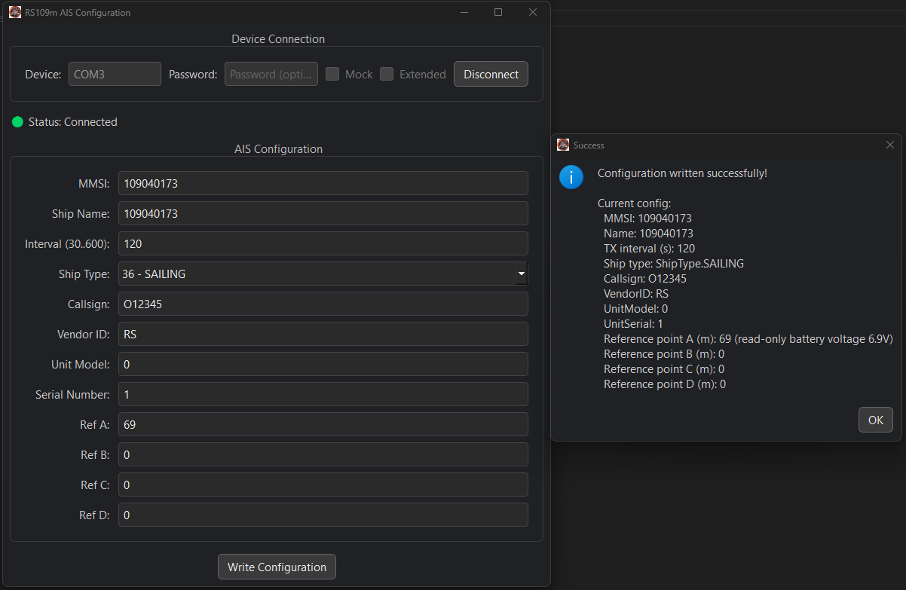

# RS-109M AIS Net Locator Configurator

A cross-platform tool for configuring the RS-109M AIS Net Locator buoy — with both a modern **command-line interface (CLI)** and a sleek **PyQt6 graphical interface (GUI)**.

This project allows you to easily read and write configuration data to the buoy over serial, replacing the manufacturer’s Windows-only software.

---

## ✨ Features

- Fully functional CLI (`rs109m_cli`) with all config fields
- Sleek GUI (`rs109m_gui`) built with PyQt6
- Automatic logging to `~/.rs109m/logs/rs109m.log`
- Validates inputs with [`pydantic`](https://docs.pydantic.dev/)
- Device connection monitor with auto-read in GUI
- Supports mock mode for development/testing
- Supports extended 0xFF config mode

---

## 🧪 Running the Application

### 💻 Windows GUI Executable (No Python Required)

You can download a pre-built version of the GUI application (Windows only) here:

👉 **[Download rs109m.zip](https://github.com/mattcoulter7/rs109m/releases/download/1.0.2/rs109m.zip)**

1. Unzip the file.
2. Run `rs109m_gui.exe` inside the extracted folder.

> ⚠️ **Important Notes**:
> - This version has **only been tested on Windows** using the **mock device mode**.
> - It has **not yet been tested with a real RS-109M device**.
> - Please use at your own precaution if attempting to connect to real hardware.

---

## 🛠️ Developer Installation

If you want to run or modify the source code locally:

1. **Install [Poetry](https://python-poetry.org/docs/#installation):**

```bash
curl -sSL https://install.python-poetry.org | python3 -
```

2. **Clone the repository and install dependencies:**

```bash
git clone https://github.com/mattcoulter7/rs109m.git
cd rs109m
poetry install
```

You can now use the CLI or launch the GUI:

```bash
poetry run rs109m_cli read --device=fake_device --mock
poetry run rs109m_gui
```

### 📟 CLI (Command Line)

Run the CLI via Poetry:

```bash
poetry run rs109m_cli read --device /dev/ttyUSB0 --password 000000
poetry run rs109m_cli write --device /dev/ttyUSB0 --password 000000 --mmsi 123456789 --name "TestShip" ...
```

You’ll be prompted for any missing config values.

#### 📖 CLI Help & Options

To explore the available options:

```bash
poetry run rs109m_cli read --help
```

```
Usage: rs109m_cli.cmd read [OPTIONS]

Options:
  --device, -d     TEXT     Serial port (e.g. /dev/ttyUSB0) [required]
  --password, -P   TEXT     Password (leave blank for default)
  --mock                    Use the mock device IO instead of a real device
  --extended, -E            Operate on 0xff size config instead of default 0x40
  --help                    Show this message and exit.
```

```bash
poetry run rs109m_cli write --help
```

```
Usage: rs109m_cli.cmd write [OPTIONS]

Options:
  --device, -d       TEXT     Serial port device (e.g. /dev/ttyUSB0) [required]
  --password, -P     TEXT     Password (leave blank for default)
  --mmsi, -m         INTEGER  MMSI (leave blank to keep current configuration)
  --name, -n         TEXT     Ship name (leave blank to keep current configuration)
  --interval, -i     INTEGER  Transmit interval in seconds [30..600]
  --type, -t         INTEGER  Ship type (leave blank to keep current configuration)
  --callsign, -c     TEXT     Call sign (max 6 characters)
  --refa, -A         INTEGER  Reference A (leave blank to keep current configuration)
  --refb, -B         INTEGER  Reference B (leave blank to keep current configuration)
  --refc, -C         INTEGER  Reference C (leave blank to keep current configuration)
  --refd, -D         INTEGER  Reference D (leave blank to keep current configuration)
  --vendorid, -v     TEXT     AIS unit vendor id (3 characters)
  --unitmodel, -u    INTEGER  AIS unit vendor model code
  --sernum, -s       INTEGER  AIS unit serial num
  --mock                      Use the mock device IO instead of a real device
  --extended, -E              Operate on 0xff size config instead of default 0x40
  --help                      Show this message and exit.
```

These CLI tools are ideal for scripting or advanced usage, and they follow the same validation rules and configuration structure as the GUI.

### 🖥️ GUI (Graphical Interface)

```bash
poetry run rs109m_gui
```

1. Enter the serial port (e.g. `COM3`, `/dev/ttyUSB0`)
2. Add password if required (defaults to `000000`)
3. Enable mock or extended config if needed
4. Click **Connect** to begin polling the device
5. If connected, edit fields and click **Write Configuration**

⚠️ **You must connect to the device within a few seconds of powering it on.**  
If a write fails, unplug/replug the device and try again.


#### 🖼️ Screenshot

  
*A sleek PyQt6 interface for reading and writing RS-109M configuration*

---

## 🪪 Identifying the COM Port

On **Windows**, use this command in PowerShell:

```powershell
mode
```

You’ll see available COM ports (e.g. `COM3`, `COM4`) which correspond to the USB device.

---

## 📂 Logs

Logs are written to:

```
~/.rs109m/logs/rs109m.log
```

You’ll see details of each read/write attempt, connection status, and validation feedback — useful for debugging and support.

---

## 🧪 Running Tests

This project uses `pytest` with optional dotenv support.

```bash
poetry run pytest
```

You can include `.env.test` to inject test-specific variables if needed.

---

## 📦 Download Pre-built Executables

You can download pre-built standalone binaries (for Windows/macOS/Linux) from the [latest release page](https://github.com/your-org/rs109m/releases/latest).

No Python installation required — just unzip and run!

---

## 📜 Notes on Legality

> ⚠️ **Important:** It is questionable whether this device is legal for AIS use in all jurisdictions.

Please consult with your local maritime authority before operating the RS-109M Net Locator.  
See this [FCC statement](http://web.archive.org/web/20210806152632/https://docs.fcc.gov/public/attachments/DA-18-1211A1_Rcd.pdf) on the ban of AIS fishing net buoys.

---

## 👨‍🔬 Internals

- Communicates via **115200 baud, 8N1 serial**
- Config must be read/written **within the first few seconds after power-up**
- Supports 0x40 and 0xFF config blocks
- Uses a simple init+password handshake protocol
- Reference A is often used for **battery voltage reporting**

Full protocol logs can be found in `bin/logs/` (if present).  
See `rs109m/driver_service/` for details on how messages are encoded and parsed.

---

## 🧠 Contributing

Pull requests are welcome!

- Fork this repo and create a feature branch
- Install with `poetry install`
- Run and test changes via `poetry run rs109m_cli` or `poetry run rs109m_gui`
- Log output is always available in `~/.rs109m/logs/`

---

## 🧾 License

This tool is licensed under the **MIT License**.  
Originally developed by [Sönke J. Peters](https://github.com/speters)  
Modernised, expanded and maintained by [Matthew Coulter](mailto:mattcoul7@gmail.com)

---

## 🙏 Credits & Acknowledgements

This project builds on top of the excellent open-source work by:

- [@speters](https://github.com/speters) – **Sönke J. Peters**  
- [@bjoernrost](https://github.com/bjoernrost) – **Björn Rost**

Their original driver and protocol reverse-engineering can be found here:  
👉 **[github.com/speters/rs109m](https://github.com/speters/rs109m/tree/main)**

We have extended the work by:

- Adding a modern CLI using [Typer](https://typer.tiangolo.com/)
- Introducing input validation with [Pydantic](https://docs.pydantic.dev/)
- Building a full-featured GUI with [PyQt6](https://www.riverbankcomputing.com/software/pyqt/)
- Implementing background device monitoring
- Packaging with [Poetry](https://python-poetry.org/)

Big thanks to the original authors for laying the foundation — this project would not exist without their contributions. 💙

---

Enjoy hacking the RS-109M! 🔧📡  
If you find this useful, give the project a ⭐️ and share your findings.
